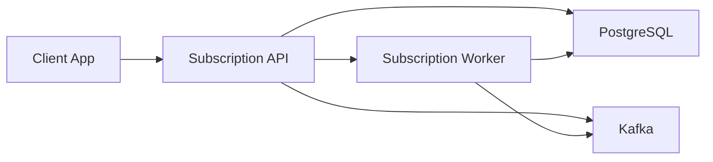

# Container Diagram

```mermaid
flowchart LR
    Client["Client App"] --> API["Subscription API"]
    API --> Worker["Subscription Worker"]
    API --> DB["PostgreSQL"]
    API --> Kafka["Kafka"]
    Worker --> DB
    Worker --> Kafka
```
