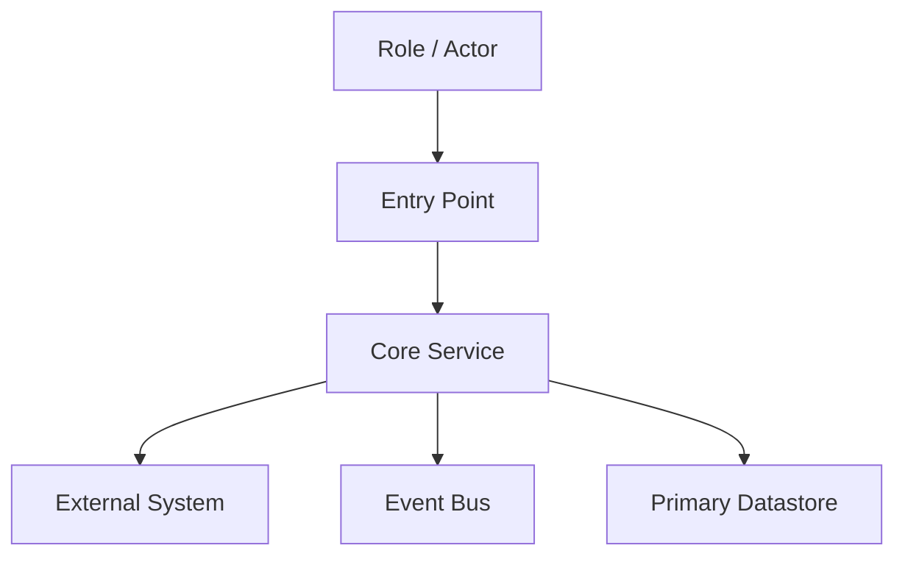

# Context Diagram

```mermaid
flowchart TB
    User["Role / Actor"] --> Client["Entry Point"]
    Client --> Core["Core Service"]
    Core --> External["External System"]
    Core --> Events["Event Bus"]
    Core --> DB["Primary Datastore"]
```
