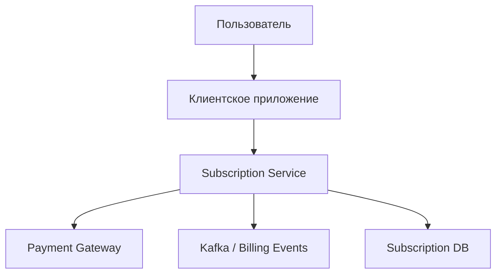

# Context Diagram

```mermaid
flowchart TB
    User["Пользователь"] --> Client["Клиентское приложение"]
    Client --> Subscription["Subscription Service"]
    Subscription --> Payment["Payment Gateway"]
    Subscription --> Events["Kafka / Billing Events"]
    Subscription --> DB["Subscription DB"]
```
