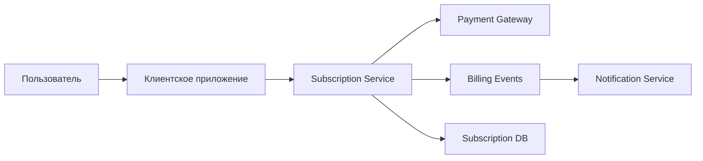

# System Context

## Описание

- Клиентское приложение инициирует сценарии управления подпиской.
- `Subscription Service` координирует бизнес-логику и запись в БД.
- События оплаты и активации передаются через Kafka.
